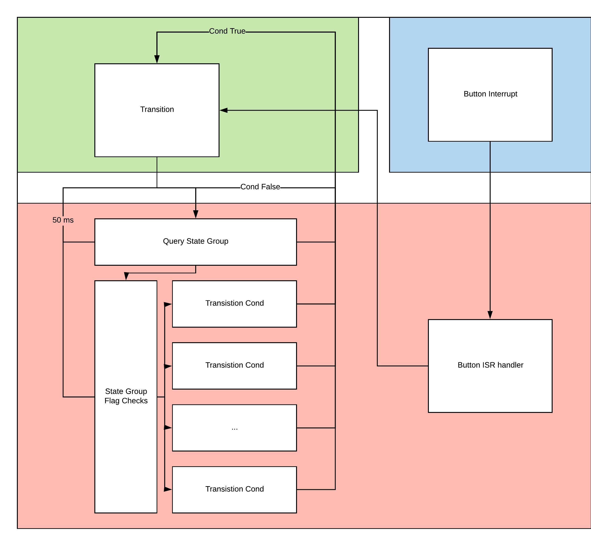

# Fuel Cell Controller Code
*Written for the 2017-2018 version of Fuel Cell Controller.*


The software for the Fuel Cell Controller is designed to make use of of mbed's RTOS functionality.


## Structure and task scheduling
The software is split into five-six different threads, each handling a different aspect of FCC. The overall scheduling scheme used is preemptive task scheduling. Therefore each thread has an assigned priority with the most real-time sensitive tasks (such as error handling) being placed in the higher priority threads.


The six threads are as follows, in order of highest to lowest priority:

* Error High
* Error Low
* Controller State Machine
* Monitoring
* Datalogging/Communications
* OLED Screen (*Not Yet Implemented*)

Each thread essentially is just an eventqueue, which dispatches forever, and a collection of events. Some events are posted to the queue periodically, and some posted after certain conditions are met.

### Datalogging
*Please note the current datalogging was not designed well and as a result is inefficient and prone to causing system deadlock. This will be addressed in datalogging 2.0 [To be worked on after FCC-code 1.0 release]*

**Datalogging 1.0 works, however not very well due to the sheer # of blocking requests**

Datalogging consists of three periodically posted tasks, each task queries global I/O objects and then writes the data to it's respective serial port.

Since we have three serial ports being used (OpenLog, Bluetooth, FTDI) there are three tasks. At the moment bluetooth and the FTDI chip share the same data formatting. Openlog log prints a header on start up detailing column names, follwed by only the respective values in the following records. FTDI and the bluetooth follow the "name:value" format at this moment.

### Monitoring and the State Machine
These two threads together make up the normal control portion of the FCC. The combination of the two threads is essentially a thread safe state machine, with a few auxiliary functions.

The state machine can be split into three parts.
* The State
* The Transition
* The Transition Control

#### The state and the transition
The state is the state of the DigitalOut pin. Each state has an `Event` dedicated for the transistion into said state. A state is persistent until one of two conditions happen.

<dl>
    <dt><b>Transition control posts a transistion.</b></dt>
    <dd>This happens when the transition controller determines that a transition is nessecary</dd>
    <dt><b>Error has been detected and state machine is shut-down</b></dt>
    <dd>When an error happens it shuts down the state-machine and then externally enters the alarm state.</dd>
</dl>

The transition code for each state is very simple, consisting of merely a few DigitalOut pin writes and a few bitwise operations. The format for transition events is:
```C++
Event<void()> transition_event(&queue, transition);

void transition(){
    // Header

    // Transition

    // Trailer
}
```
The header is responsible for clearing old flags and additional set up (state group if transitioning between state groups). The transition is self explanatory. The trailer is responsible for setting flags and indicating to the transition controller the transition is complete. This is done with an `Event`.

> State Groups & States
> * Start
>   * Start Entry
>   * Start Purge
>   * FC Charge Entry
>   * FC Charge Exit
> * Charge
>   * Charge Entry
>   * Cap Charge Start
>   * Cap Charge Exit
> * Run
>   * Run Entry
> * Purge
>   * Purge Entry
>   * Purge Exit
> * Shutdown
>   * Shutdown Entry
> * Alarm*
>
>*Alarm is not actually a part of the state machine, will be explained later*

State groups are a collection of multiple smaller sub-states. This is because a state-machine is static, any transformation of the state is a transition. The states required to achieve an overall task (such as start-up) are grouped together.

*Purges are not split into two states*

State Codes:
* Start State [code = 1]
* Charge State [code = 2]
* Run State [code = 3]
* Purge State [code = 4]
* Shutdown State [code = 5]
* Alarm State [code = 6]

#### Transition Control


### Errors
Errors in the FCC are found by using the polling method. Every 50ms an `Event` for each error we want to monitor is posted to the lower error queue. Errors use the interrupt method whenever possible, such as the hydrogen alarm and emergency stop buttons. This allows them to be dealt with nearly instantly, as opposed to having to wait to be polled, which is one of the main drawbacks of the polling method.

Each error check `Event` is a short method that preforms a few checks, posting an error `Event` to the higher error queue. These error `Events` can be specific although at the moment all error's use a single error handling task. This task kills the statemachine thread and queue then sets the FCC into `ALARM_STATE`

#### Supported Errors
There are multiple errors that the FCC detects.
* No Error [code = 0]
* FC Over-voltage [code = 1]
* FC Over-current [code = 2]
* Hydrogen Line Over-pressure [code = 3]
* FC Over-temperature [code = 4]
* Hydrogen Line Under-Pressure [code = 5]
* FC Under-temperature [code = 6]
* H2 Sensor Alarm [code = 7]
* E-Stop 1 Alarm [code = 8]
* E-Stop 2 Alarm [code = 9]
* Stop Alarm [code = 10]


### Datalogging/Communications

### OLED Screen
